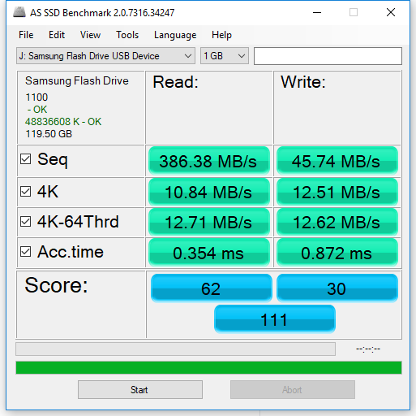
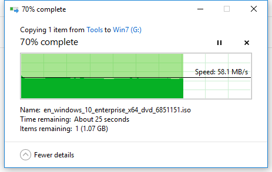
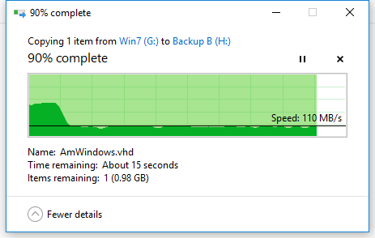

# Samsang_bar_plus_test
# 测试环境: 

Windows 7, 
USB3.0用PCI-E扩展卡转接 https://detail.tmall.com/item.htm?id=559052909460&spm=a1z09.2.0.0.23062e8dSZAI65&_u=h9ipku5bb0f&skuId=3754028516902
DIEWU PCI-E转usb3.0扩展卡 
NTFS快速格式化

## 芯片检测
实际是单通道.
https://bbs.luobotou.org/thread-47543-1-1.html

## Samsung Bar+ 128G U盘测速
有意思的是原生USB3.0接口的4k写入速度居然不及 PCI-E转接USB3.0接口，
比较固态硬盘，写入速度是真没法比的，但是当时就是看中这款u盘的4K速度甚至比闪迪的cz880还要好。

### PCI-E转接USB3.0性能测试

### 原生USB3.0性能测试

## Sandisk 256G 固态硬盘测速

## PCI-E转接USB3.0单个大文件写入/拷贝测试(2.7GB)
写入快到结束时，停了10几秒，应该是缓存数据了。

读数据很流畅，无卡顿，结尾没有任何停顿。

# 原生USB3.0接口单个大文件写入/拷贝测试

### 3.6GB 单个文件写入

### 10GB 单个文件读取（到高速7200转机械硬盘）

### 10GB 单个文件读取（到SSD固态硬盘）

