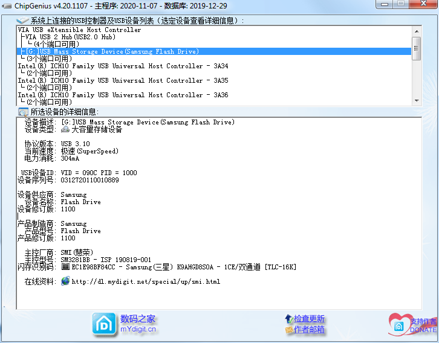
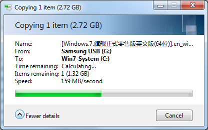

# Samsang_bar_plus_test
# 测试环境: Windows 7, USB3.0, NTFS快速格式化

## 芯片检测
实际是单通道.
https://bbs.luobotou.org/thread-47543-1-1.html

## Samsung Bar+ 128G U盘测速

## Sandisk 256G 固态硬盘测速

比较固态硬盘，是真没法比的，但是4K读写确实不错。

## 单个大文件写入/拷贝测试(2.7GB)
**写入快到结束时，停了10几秒，应该是缓存数据了。**

**很流畅，无卡顿，结尾没有任何停顿。**

